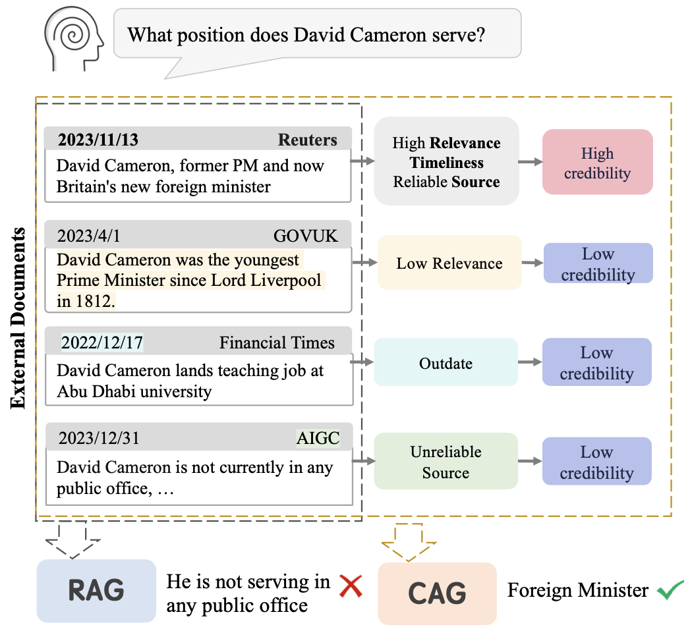

# CAG

This repository contains the code, data and models for the paper _Not All Contexts Are Equal: Teaching LLMs Credibility-aware Generation_.


## QuickStart

You can download our Credibility-aware Generation model and our Credibility-aware Generation Benchmark from HuggingFace Hub.

[CAG 7B model](https://huggingface.co/ruotong-pan/CAG-7b) | [CAG 13B model](https://huggingface.co/ruotong-pan/CAG-13b) | [CAG Mistral 7B model](https://huggingface.co/ruotong-pan/CAG-mistral-7b) | [CAGBenchmark](https://huggingface.co/datasets/ruotong-pan/CAGB)

To evaluate the model you need to install the environment.

```
pip install -r requirements.txt
```

## CAGB

The CAGB contains 3 scenarios with a total of seven datasets.

- Open-domain QA
  - 2WikiMultiHopQA
  - HotpotQA
  - Musique
  - RGB
- Time-sensitive QA
  - EvoTempQA
- Misinformation Polluted QA
  - NewsPollutedQA

Each dataset contains data files under three settings: _concat_ means that the documents are randomly sorted and directly concatenated, _rerank_ means that the documents are reranked according to relevance, where the document with the highest relevance is closest to the question, and _cred_ means that the documents are randomly sorted, with a credibility label marked before each document.

Data files containing _qstart_ are used to evaluate models with instruction following capabilities, with their questions located at the front of the prompt. Data files without _qstart_ are used to evaluate language models, to enable them to avoid forgetting the question, and the questions in these files are located at the end of the prompt.

## Evaluate

Set up CAG prompt in Fastchat, add the following code in Fastchat/fastchat/conversations.py

```
register_conv_template(
    Conversation(
        name="CAG",
        system_message="A chat between a curious user and an artificial intelligence assistant. "
        "The assistant gives helpful, detailed, and polite answers to the user's questions."
        "The assistant answers questions based on given passages. Each article has a credibility rating that is categorized as: high, medium, or low. Credibility reflects the relevance and accuracy of the article to the question. The assistant's answer will need to synthesize the content and credibility of multiple articles.",
        roles=("USER", "ASSISTANT"),
        sep_style=SeparatorStyle.ADD_COLON_TWO,
        sep=" ",
        sep2="</s>",
    )
)
```

Setting-type indicates the scenario to be evaluated, options include: concat, rerank, cred.

```
#Eval the LM
bash scripts/llama7b.sh

#Eval Chatgpt
bash scripts/chatgpt.sh

#Eval CAG
bash scripts/cag-7b.sh
```

## Training

Our training data is available [here](https://drive.google.com/file/d/1gQgdLaQON1tqflHNbJmjS5jGZU_m9mjg/view?usp=sharing).

We use [FastChat](https://github.com/lm-sys/FastChat) to fine-tune the LLaMA 7B, 13B model and use [axolotl](https://github.com/OpenAccess-AI-Collective/axolotl) to fine-tune the Mistral 7B model.

## Citation

```
@misc{pan2024contexts,
      title={Not All Contexts Are Equal: Teaching LLMs Credibility-aware Generation},
      author={Ruotong Pan and Boxi Cao and Hongyu Lin and Xianpei Han and Jia Zheng and Sirui Wang and Xunliang Cai and Le Sun},
      year={2024},
      eprint={2404.06809},
      archivePrefix={arXiv},
      primaryClass={cs.CL}
}
```
